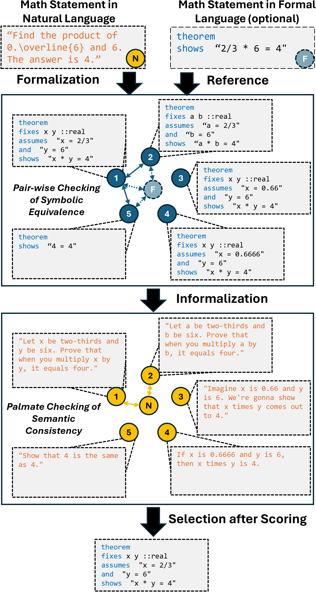

# ASSESS

The framework of our paper(assess) includes the following parts: dataset, data-generation, equiv_checker,scala-isa-project,website. For quick start, please read [Quick start](#quick-start) directly.

tips:If you encounter some problems that cannot be solved, please feel free to contact me

todo: Project framework diagram here



### Quick start
First, we recommend using the [Dockerfile](../Dockerfile) for quick builds, but you can also configure the environment locally.
```
docker run -itd -v <repo_dir>:/app <image>
```
Second, please check the instructions in the [data-generaton](#data-generation) section to generate data from math and minif2f, including calling gpt4 to generate answers, format modifications, etc.

After completing the data generation, enter the main part of our framework [equiv_checker](#equiv_checker), please follow the [doc](./equiv_checker/readme.md) for the experiment.

Finally, you can check the status of the equivalence clusters on the website and perform manual annotation based on the equivalence clusters to choose the generation you think is correct. This process can be iterated many times until you think there is no problem with the annotation of the data.


### Dataset
Includes minif2f and MATH data sets, as well as MATH data processing scripts

### data-generation
For the original dataset, use gpt4 for the generation of formal problem, formal solution and informal problem

### equiv_checker
The main experimental part of ASSESS, calculating symbolic equivalence and predict

### scala-isa-project
An interface to Isabelle with Scala, and use python to call the scala interface.

### website
The manual annotation website we developed which is used to manually judge whether the generation of gpt4 is correct.
- notice: The data in the dataset will not be updated to git in real time with the annotations on the website. If you use multiple servers to perform different data operations, please manually synchronize the data.


